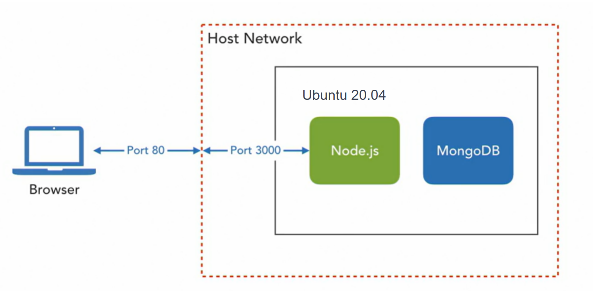
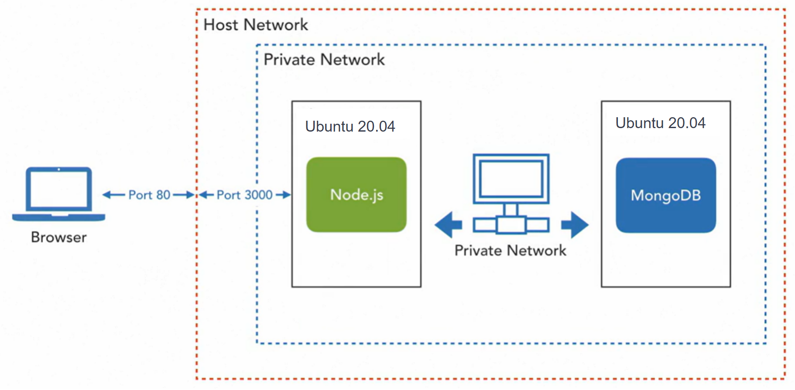

<center><h1> Vagrant Clustering </h1></center>
<p>Clarusway</p>
<br>

## Application developer environment overview

Now we're going to bring together the CLI commands and Vagrant features to fully demonstrate the power of Vagrant, defining an isolated, portable development environment. To do that, we'll need a platform and the code for an application. 

We'll be using a simple Node application to demonstrate the steps required to create a Node runtime and development environment. Don't worry if you don't know Node or JavaScript. The purpose is not to teach you how to write a Node application. While these steps will be specific to Node, the concepts are generally applicable to any platform. This could be a .NET, Java, Python, Ruby, or any other type of application. The steps we'll be demonstrating will apply in some way to all of those platforms.

### Get the source code
- Clone the source code for this demonstration from Github.
```sh
git clone https://github.com/bluehackrafestefano/Vagrant_Node_Cluster_Start.git
```

- Delete `.git` folder manually or using the terminal command;
```sh
rm -rf .git
```

- Push the code to your own Github repository using the VSCode Source Contol button. That makes the it your own repo.

This is a very simple Node application that exposes a to-do list web service. The web service returns a list of to-do tasks and accepts post requests to add and update tasks. 

### Planning

- We'll be adding a Vagrant file to this code to define a Node development environment. 
- We'll be using the default synchronized folder. The application code will reside on the host, and we'll use a synced folder to automatically synchronize that code with the code in the Vagrant box. This will allow us to edit the code in Visual Studio code on the host, and see the changes take effect as they're synchronized with the box. 
- We'll use port forwarding to expose the Node application to the host browser. We'll use a provider to tweak the provider settings to set the right amount of memory for our application. 
- And we'll use a provisioning script to install all the necessary software and set configurations we need to run a Node application. 


The result of this set-up will be a custom box based on the Ubuntu 20.04 base box. The custom box will include all the necessary software installations to run the application. We'll be able to make changes to the code from the VSCode and see those changes take effect as we use the application from a host browser. The Node application will be configured to start automatically on boot. We'll be able to re-start the box after the initial provisioning start, and the application will start itself on boot.




This diagram illustrates a single server test environment. The entire application, including both Node and MongoDB, are run in a single box. The box runs on a standard network configuration using port forwarding to expose the Node application. 

## Creating a developer environment

- Before we get started use the vagrant global status command to check for any other running boxes. If there are any other boxes running you can use vagrant halt and the ID to stop them;
```sh
vagrant global-status
vagrant halt < box-id >
```

- Once that's done, we'll use the vagrant CLI to add a new vagrant file;
```sh
vagrant init bento/ubuntu-20.04
```

- This will add a new vagrant file. You can open the vagrant file by double clicking it in the Explorer pane on the left. The first edit we need to make is to line 26. Node applications listen on port 3000 by default. We need to create a port forwarding configuration to expose that port to the host. On comment line 26, and modify the guest port to 3000. Leave the host port at 8080. 
```ruby
config.vm.network "forwarded_port", guest: 3000, host: 8080
```

- The synced folder setting is here on line 46. However we're going to leave it commented. We're going to use the default synced folder behavior to synchronize the code between the host and box. Vagrant will automatically sync the vagrant environment folder on the host with a slash vagrant directory mounted to the root of the vagrant VM. We added a vagrant file to the root directory of this node application which in turn made it into a vagrant environment. As we edit the code on the host here in VSCode, the changes will be synchronized to the vagrant directory in the vagrant box. 

- Our next configuration change is here in the provider settings. You'll need to uncomment line 59 and line 64 and line 65.
```ruby
  config.vm.provider "virtualbox" do |vb|
    vb.memory = "2048"
  end
```

- The last configuration change we need to make is to set up the provisioners that will install the software we need to run this application. The provisioners are already included with the code here in the provisioners directory. Let's take a look at these two provisioner scripts. First we'll look at the `install-mongo.sh` script. The todolist web service uses the MongoDB NoSQL database to persist data. This script performs the commands needed to install MongoDB using the APT package manager.

- Now let's turn the `node-install.sh` file. Once again, commands update the APT sources and install Node and the package manager NPM. After that, the script uses NPM to install a Node utility, PM2. PM2 is a node process manager which is used to run Node applications. One of the useful features of PM2 is that it can run a Node application as a service in the background. This is a typical way to run Node applications in production. The command starting on line 15 use NPM to download the dependencies for the todolist application. This is a typical bootstrapping step. A Java application might use Maven or Gradle. A .NET app would use newgap. The next several lines use PM2 to set up the application as a service and to restart itself when the box reboots. The commands on line 26 to 28 wait for the application to start before continuing. 

The final command executes HTTP requests from the command line. Curl can do more than just issue git requests to view a page. It can also issue GET and POST requests to a web service. This command creates a task in the todolist service after it's started. This seeds the task list with some sample data. It also serves as a test if a provisioning script encounters an error, it will report the error to the console as the box starts for the first time. This can alert a developer to problems with the vagrant file or the provisioners. 

- Now we need to refer to these scripts from the vagrant file. Return to the vagrant file in the editor and uncomment line 73. Remove the line and replace it with the lines below;
```ruby
  config.vm.provision "shell", path:"provisioners/install-mongo.sh"
  config.vm.provision "shell", path:"provisioners/install-node.sh"
```

Take note that the provisioners will run in the order they are listed in the vagrant file. This is important to us because these scripts must be run in this order. If we try to run the Node installation first, the last line where the script adds a task by calling the web service will fail. The Node application is dependent on MongoDB which must be installed and running before the web service can function properly. 

- The vagrant file is now complete. Let's start it and watch what happens:
```sh
vagrant up
```

The box will start, and you'll see the provisioners execute. The provisioners will install MongoDB, Node, the PM2 process manager and then call the web service to add a sample task. 

- After the `vagrant up` command completes, open a web browser and go to `localhost:8080/tasks`. You will see a block of JSON data. If we return to the Node install script, we can see that the task returned in the browser is the one added by the script.

### Developer Workflow

- Now that our application is running, let's demonstrate the developer workflow. We'll make a change to the application in VSCode, which will be automatically synchronized to the code running in the box. 

- Return to the browser and let's take a look at the JSON data. We can see that each task has a status attribute. Now try this. Go to `localhost:8080/tasks/status/pending`. You'll get a 404 error because that route is currently undefined. Let's suppose that we want to be able to query this service for tasks by status. We'll make the change needed to the code, then demonstrate that it works. I'll make the change needed to implement this route. Again, don't worry about understanding the code. We're just demonstrating that edits to the files in the host are copied to the box. 

- So our first step will be to go to the routes and we will uncomment the code here. `api/routes/todoListRoutes.js` lines 16-17.

- And then we'll go to the controllers. And then we'll uncomment this method here. `api/controllers/todoListController.js` lines 32-38. And save as we go. Now return to the browser, and we should be able to refresh. This time, instead of a 404 error, we see the task that was entered when the box was provisioned.

Modifying the code in VS code automatically copied it into the /vagrant directory in the box, which is where the code for the application is actually running. 

Let's take a minute to think about how vagrant can impact software development by making these purpose built environments possible. Adding a vagrant file to this or any code repository alleviates the need to know how to set up a runtime and development environment. It doesn't end there. The vagrant files and provisioners are a self documenting application runtime configuration. By reading the vagrant file and provisioning scripts, a developer can quickly learn how to set up the environment for a given code base. 

Also, keep in mind that every app is different. For example, we could write a variant of this application that uses MySQL or PostgreSQL instead of MongoDB. If you start including a vagrant file with the applications you write, you'll include the runtime definitions of your application along with the code. You then won't have to remember how to set up the environment for your applications because the environment is defined with the code. Even better, you won't have to set it up for anyone else as long as they're also using vagrant.

### Cleanup

- Exit from the box, delete the box and Vagrantfile to prepare for the next part of the hands-on:
```sh
exit
vagrant destroy
rm Vagrantfile
rm -r node_modules
rm -r .vagrant
```

## Clustering

By default, Vagrantfiles start a single box. This is certainly useful for testing software in a sandbox environment, but it's not how applications are usually run in production environments. Test environments often combine application tiers such as application and database in a single server. Production  infrastructures typically separate those roles and run apps on one server and databases on a separate server. Vagrant can run boxes in the same way, with multi-machine Vagrantfiles. Here is an illustration of a more production-like environment. 



Node and Mongo each have their own box. The boxes run on a private network so they can communicate with each other and the host through Vagrant, but they're isolated from other networks. In this context, `remote simply` means that the Mongo database is running on a different server from the Node application.

- We'll create a new Vagrantfile;
```sh
vagrant init bento/ubuntu-20.04
```

- Open the Vagrantfile. The Vagrant file can define any number of boxes. The first step is to create the definitions. Look at the statement on line eight. This statement creates a config object, which is used to edit the settings of the box. You'll notice that most of the other lines here start with the config object with dot notated properties. We can create a new object using define. 

### Configure MongoDB

- Add a new line after line 14, and enter;
```ruby
  config.vm.define "mongo" do |mongo|
  end
```

This will be the definition of a separate Mongo database server. The block creates a nested configuration for a box that we're calling mongo. You can use any word you want to describe a box. The word you choose must be exactly the same between the quotes and the pipes. 

- Now, add a line between the define and end statements;
```ruby
  config.vm.define "mongo" do |mongo|
    mongo.vm.box = "bento/ubuntu-20.04"
  end
```

Note that the beginning of this line is `mongo` instead of `config`. The define statement has created a new object to work with, the mongo object. We can now configure the mongo box using all the same statements as before, as long as they are within this block and prepended with mongo. The statements in this block will have no effect on any other defined blocks, as we'll see shortly.

- Now, let's enter, after this line;
```ruby
  config.vm.define "mongo" do |mongo|
    mongo.vm.box = "bento/ubuntu-20.04"
    mongo.vm.provider "virtualbox"do |vb|
      vb.memory = "512"
    end
  end
```

The provider configuration is also a block with an end statement. This block creates a vb object to work with the settings for the VirtualBox provider. Here, we've set the RAM allocation to 512 megabytes.

- Now we'll use a private network to connect the two boxes defined by this Vagrant file. After this end statement, enter;
```ruby
  config.vm.define "mongo" do |mongo|
    mongo.vm.box = "bento/ubuntu-20.04"
    mongo.vm.provider "virtualbox"do |vb|
      vb.memory = "512"
    end
    mongo.vm.network "private_network", ip: "192.168.33.20"
  end
```

This statement will use a private network for the Mongo box and use a fixed IP address. The Node application will connect to the Mongo database by IP. 

- Mongo won't work out of the box in this setup. It needs a customized configuration to allow connections from remote servers. That configuration is stored in a config file. We'll use a file provisioner to copy a customized config file from the host to the box. Our customized config file is already here in the files directory, so we'll add;
```ruby
  config.vm.define "mongo" do |mongo|
    mongo.vm.box = "bento/ubuntu-20.04"
    mongo.vm.provider "virtualbox"do |vb|
      vb.memory = "512"
    end
    mongo.vm.network "private_network", ip: "192.168.33.20"
    mongo.vm.provision "file", source: "files/mongod.conf", destination: "~/mongod.conf"
  end
```

- The last statement we need in this block is the provisioner. This is the same provisioner we've used before;
```ruby
  config.vm.define "mongo" do |mongo|
    mongo.vm.box = "bento/ubuntu-20.04"
    mongo.vm.provider "virtualbox"do |vb|
      vb.memory = "512"
    end
    mongo.vm.network "private_network", ip: "192.168.33.20"
    mongo.vm.provision "file", source: "files/mongod.conf", destination: "~/mongod.conf"
    mongo.vm.provision "shell", path: "provisioners/install-mongo.sh"
  end
```

### Configrue Node

- The Mongo database server configuration is now complete. We're ready to start the Node application server configuration. Below the Mongo block end statement, enter;
```ruby
  config.vm.define "node" do |node|
    node.vm.box = "bento/ubuntu-20.04"
  end
```

This is the Node application server block. This box also uses the Ubuntu 20.04 base box.

- Below this line;
```ruby
  config.vm.define "node" do |node|
    node.vm.box = "bento/ubuntu-20.04"
    node.vm.network "forwarded_port", guest: 3000, host: 8080
  end
```

The Node application server still needs port forwarding to expose the application to the host browser. Port forwarding works with private networks because the host is included in the private network.

- Lets add other configurations for Node;
```ruby
  config.vm.define "node" do |node|
    node.vm.box = "bento/ubuntu-20.04"
    node.vm.network "forwarded_port", guest: 3000, host: 8080
    node.vm.provider "virtualbox" do |vb|
      vb.memory = "512"
    end
    node.vm.network "private_network", ip: "192.168.33.10"
    node.vm.provision "shell", path: "provisioners/install-node.sh"
  end
```

As above, this block sets the memory to 512 megabytes. Together, both boxes take up about a gigabyte of RAM. The Node box is on the same private network as the Mongo box with a different fixed IP address. And the provisioner is the same as we've used before to install and configure Node.

- Lastly we need to change line 9 in server.js to reflect our private ip settings;
```js
mongoose.connect('mongodb://192.168.33.20:27017/Tododb');
```

The Vagrant life is now complete. Open the terminal and execute;
```sh
vagrant up
```

- After the startup is complete, you should be able to go to a browser and visit `localhost:8080/tasks`.

- Connecting to boxes started by a multi-machine Vagrant file is a little different from before. Vagrant ssh will connect to a single box. To connect to our Node or Mongo box, we need to include the name of the box as defined in the Vagrant file. In the terminal pane, execute;
```sh
vagrant ssh node
```

This command includes the Node-named definition. To connect to the Mongo server use;
```sh
vagrant ssh mongo
```

- Here's a quick quiz. What command could you execute here in the Node server to query the ToDoList web service? Here's a hint. We need to use curl. What would the command be? Think about how port forwarding is set up. Take a look here at the URL we used from the host browser. What port is Node listening on in the Node application server? Here's the answer: curl http://localhost:3000/tasks. Remember, Node is listening on port 3000 in the Node application box. The port forwarding configuration makes that service available to the host on port 8080.

- At the end of the session delete the boxes:
```sh
vagrant destroy
```

### Conclusion

This completes our multi-machine Vagrant file. So, why would we want to run multiple boxes? A production configuration helps you design and test your application in a real-world setting. I had to make some changes to the application and the Mongo configuration to allow the Node application server to connect to the Mongo server. By separating the servers, I was able to set up an infrastructure that would be valid in a production environment. Addressing that concern early in the development process is a good devops process.

<br>

**<p align="center">&#9786; Happy Coding! &#9997;</p>**

<p>Clarusway</p>
